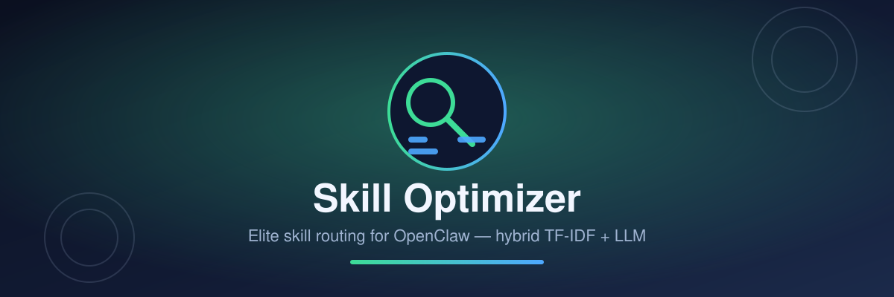

<div align="center">



# 🔧 Skill Optimizer — Plugin OpenClaw

**Elite skill routing untuk OpenClaw** — rekomendasi skill otomatis per pesan (hybrid TF-IDF + LLM), tool `recommend_skills`, dan perintah `/skills`.

[](https://github.com/openclaw/openclaw)
[](LICENSE)
[](https://clawhub.ai)

</div>

--- Tanpa plugin ini, agen sering "lupa" bahwa ada skill panduan untuk tugas tertentu — LLM hanya menebak dari daftar singkat skill di system prompt. Plugin ini memindai seluruh `SKILL.md` milik Anda, lalu **menganalisis tiap pesan pengguna** dan menyuntikkan ringkasan skill yang benar-benar relevan ke konteks prompt, tepat sebelum agen berpikir.

Semua fitur dirancang *fail-safe*: kalau satu bagian gagal (folder kosong, LLM tidak tersedia, API host beda versi), plugin tidak pernah mengganggu balasan normal gateway.

[What it does](#fitur) · [How it works](#cara-kerja) · [Installation](#instalasi) · [Usage](#pemakaian) · [Repo layout](#repo-layout) · [Local dev](#local-dev) · [Notes](#notes)

---

## Fitur

| Fitur | Penjelasan |
|---|---|
| 🔀 **Smart Router otomatis** | Hook `before_prompt_build` mencocokkan setiap permintaan dengan indeks skill; hasilnya dikirim sebagai `{ prependContext }` sehingga agen membaca rekomendasi sebelum menjawab. |
| 🧠 **Pencocokan Hybrid** | Tahap 1: skor **TF-IDF** cepat & offline (nama + deskripsi + kata kunci + isi SKILL.md) lengkap dengan fuzzy typo (Levenshtein). Tahap 2: bila skor terbaik rendah (< `semantic.strongScore`), jatuh kembali ke **semantic matching via LLM** (`z-ai-web-dev-sdk`, atau endpoint kompatibel OpenAI apa pun). |
| 🛠️ **Tool on-demand** | Tool `recommend_skills` bisa dipanggil agent kapan saja untuk mencari skill tanpa menunggu injeksi otomatis. |
| 💬 **Perintah chat** | `/skills list`, `/skills find <kata>`, `/skills reload`, `/skills stats`. |
| 📊 **Statistik pemakaian** | Pencatatan ringan (tanpa isi pesan): skill paling sering direkomendasikan, skill tak tersentuh, aktivitas 14 hari, pemakaian fallback LLM — disimpan JSON di lokasi lokal. |
| 🦺 **Anti-spam & aman** | Injeksi identik tidak diulang dalam jendela waktu (`dedupWindowMs`), perintah `/xxx` dilewati, batas panjang blok (`maxChars`), dan semua handler dibungkus try/catch. |

## Cara kerja

```
pesan pengguna
      │
      ▼
[before_prompt_build]
      │  scan folder skills (cache TTL 60 dtk)
      │       ~/.openclaw/workspace/skills   (workspace)
      │       ~/.openclaw/skills             (global, hasil ClawHub)
      │       <proyek>/skills                (proyek aktif)
      │       ~/.claude/skills               (kompatibel Claude)
      │       + scanPaths tambahan (config)
      ▼
 pencocokan TF-IDF ──skor ≥ strongScore──► siap inject
      │
      └─ skor rendah → fallback semantic LLM (timeout ketat)
                          │ gagal? tetap pakai hasil keyword
      ▼
{ prependContext: "<skill_recommendations> … </skill_recommendations>" }
      ▼
agen membaca konteks lalu menjawab seperti biasa
```

Catatan penting tentang ClawHub: skill yang Anda install lewat `openclaw skills install` (dari [ClawHub](https://clawhub.com)) tersimpan sebagai folder `SKILL.md` di workspace/global — plugin ini **otomatis mendeteksinya**, tanpa perlu tahu asal install-nya.

## Persyaratan

- OpenClaw dengan Node **22+** (sesuai persyaratan plugin resmi).
- Untuk fitur fallback semantic via Z.ai: lingkungan gateway punya `z-ai-web-dev-sdk`.
  Tidak ada SDK / tanpa jaringan? Plugin tetap bekerja penuh dalam mode keyword TF-IDF.
- Ingin fallback via provider lain: isi `semantic.openaiBaseUrl` + `semantic.openaiApiKey`
  (kompatibel format chat completions OpenAI).

## Instalasi

### Cara A — script installer (disarankan untuk instalasi lokal)

```bash
cd openclaw-skill-optimizer
chmod +x install.sh
./install.sh            # menyalin ke ~/.openclaw/extensions/skill-optimizer
```

### Cara B — link manual (development)

```bash
openclaw plugins install -- link ./openclaw-skill-optimizer --force
openclaw plugins enable skill-optimizer
```

### Cara C — publish ke ClawHub (bagikan ke publik)

```bash
clawhub package publish your-org/openclaw-skill-optimizer
# pengguna lain tinggal:
openclaw plugins install clawhub:your-org/openclaw-skill-optimizer
```

### Langkah wajib setelah install (semua cara)

Non-bundled plugin butuh izin eksplisit agar boleh membaca/mengubah konteks percakapan.
Tambahkan/merge blok ini ke `~/.openclaw/openclaw.json`:

```json
{
  "plugins": {
    "entries": {
      "skill-optimizer": {
        "enabled": true,
        "hooks": { "allowConversationAccess": true },
        "config": { }
      }
    }
  }
}
```

Contoh konfigurasi lengkap ada di [`config.example.json`](./config.example.json).
Lalu restart:

```bash
openclaw gateway restart
openclaw plugins inspect skill-optimizer --runtime --json   # verifikasi
```

Kirim `halo skil pdf laporan` atau `/skills list` di chat untuk menguji.

## Konfigurasi

Key di bawah `plugins.entries.skill-optimizer.config`:

| Key | Default | Keterangan |
|---|---|---|
| `scanPaths` | `[]` | Folder tambahan berisi skill. |
| `includeDefaultPaths` | `true` | Scan 4 lokasi standar (lihat diagram). Set `false` bila hanya ingin `scanPaths`. |
| `inject.enabled` | `true` | Nyalakan/matikan injeksi otomatis. |
| `inject.topK` | `3` | Maksimal skill direkomendasikan per giliran (1–10). |
| `inject.minScore` | `0.18` | Ambang skor TF-IDF minimum. Naikkan bila terlalu ramai. |
| `inject.maxChars` | `900` | Panjang maksimum blok konteks (hemat token). |
| `inject.skipCommands` | `true` | Jangan injeksi untuk pesan berupa command `/...`. |
| `inject.dedupWindowMs` | `90000` | Anti-duplikasi injeksi dalam jendela waktu. |
| `semantic.enabled` | `true` | Aktifkan fallback LLM. |
| `semantic.strongScore` | `0.45` | Skor keyword ≥ nilai ini → LLM dilewati (hemat biaya). |
| `semantic.threshold` | `0.3` | Skor minimum hasil LLM agar dilaporkan. |
| `semantic.timeoutMs` | `6000` | Timeout keras fallback LLM per panggilan. |
| `semantic.provider` | `"auto"` | `"zai"` / `"openai"` / `"auto"` (coba z-ai lalu openai). |
| `semantic.openaiBaseUrl` / `openaiApiKey` / `openaiModel` | – | Endpoint kompatibel OpenAI untuk mode openai. |
| `stats.enabled` | `true` | Aktifkan pencatatan statistik. |
| `stats.file` | auto | Path custom file JSON statistik. |
| `commands.enabled` | `true` | Daftarkan command `/skills`. |

## Perintah chat

```
/skills                     -> daftar semua skill terdeteksi (+ path & tag)
/skills find laporan pdf    -> uji pencarian seperti saat agen menerima pesan
/skills reload              -> pindai ulang tanpa restart gateway
/skills stats               -> laporan pemakaian & skill tak tersentuh
```

## Tool agent

Agent dapat memanggil tool `recommend_skills` (misalnya saat ragu tools mana yang dipakai):

```jsonc
// parameter
{ "query": "rapikan transkrip rapat jadi notulen docx", "top_k": 3 }
// hasil: daftar nama, deskripsi, skor, dan path SKILL.md panduannya
```

## Struktur proyek

```
openclaw-skill-optimizer/
├── index.js               # entry point: register hooks/tool/command
├── package.json           # manifest openclaw.extensions -> ./index.js
├── openclaw.plugin.json   # manifest resmi: id, contracts.tools, configSchema
├── config.example.json    # contoh blok openclaw.json
├── install.sh             # installer lokal
├── lib/
│   ├── config.js          # resolve & validasi config (default aman)
│   ├── scanner.js         # deteksi SKILL.md multi-lokasi + dedup prioritas
│   ├── frontmatter.js     # parser YAML-minimal untuk SKILL.md
│   ├── tokenize.js        # tokenizer + stopwords ID/EN
│   ├── matcher.js         # mesin skor TF-IDF + fuzzy Levenshtein
│   ├── semantic.js        # rerank LLM (z-ai / OpenAI-compatible), fail-safe
│   ├── injector.js        # builder blok <skill_recommendations>
│   └── stats.js           # store JSON atomik + formatter laporan
└── test/
    └── run-tests.mjs      # unit test + end-to-end (fake API host)
```

## Pengembangan & pengujian

```bash
npm test          # node --test — 10 kasus uji: scanner, matcher, injector,
                  # stats, parser semantic, dan end-to-end fake host
```

Tidak ada langkah build: semuanya ESM JavaScript polos sehingga `index.js`
bisa langsung dimuat OpenClaw maupun Node biasa.

### Menjalankan isolat tanpa gateway

```bash
node --input-type=module -e "
import mod from './index.js';
console.log('entry ok:', mod.id ?? typeof mod.register);
"
```

## Troubleshooting

| Gejala | Sebab umum & solusi |
|---|---|
| `/skills list` bilang "Tidak ada skill terdeteksi" | Folder belum punya struktur `<dir>/SKILL.md`, atau lokasinya non-standar → isi `config.scanPaths`. |
| Plugin tidak dimuat | Cek `openclaw plugins inspect skill-optimizer --runtime --json`; pastikan `plugins.entries.skill-optimizer.enabled = true`. |
| Rekomendasi tidak muncul di prompt | Izin hook kurang: wajib `plugins.entries.skill-optimizer.hooks.allowConversationAccess = true` lalu `openclaw gateway restart`. `allowPromptInjection` harus tetap `true` (default). |
| Terlalu banyak rekomendasi basi | Naikkan `inject.minScore` (mis. 0.3) dan turunkan `inject.topK`. |
| Fallback LM lambat | Turunkan `semantic.timeoutMs`, atau matikan `semantic.enabled` (mode offline murni). |
| Statistik hilang | File default: `~/.openclaw/skill-optimizer/usage-stats.json`; set `stats.file` bila lokasi itu tidak dapat ditulis. |

## Catatan desain

1. **Kenapa TF-IDF dulu, bukan langsung LLM?** 95 % permintaan cukup diselesaikan pencocokan kata kunci dengan biaya nol ms/nol token. Fallback LLM hanya dipanggil saat sinyal tipis — hemat latensi dan kuota.
2. **Statistik minim-data**: plugin hanya menyimpan jenis event, nama skill, skor, dan timestamp. Isi pesan **tidak** disimpan.
3. **Versi host berbeda**: semua pendaftaran (`api.on`, `registerTool`, `registerCommand`, lifecycle) bersifat opsional pada runtime — bila host tidak menyediakan salah satunya, plugin melewatinya dengan log debug, bukan crash.

## Lisensi

MIT — bebas dipakai, dimodifikasi, dan dipublikasikan ulang ke ClawHub.
